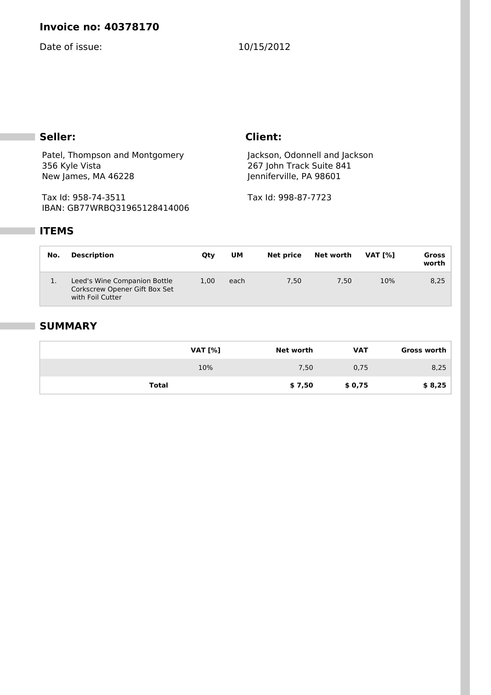
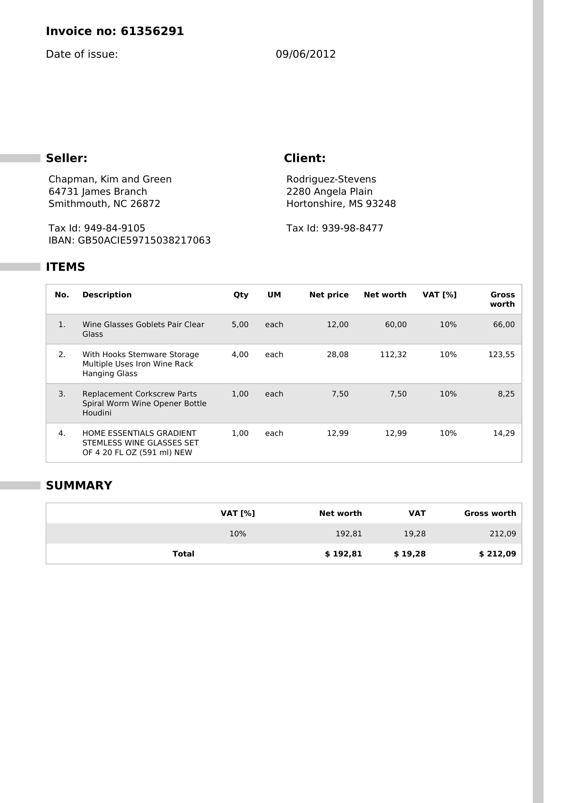

# Blueshift Invoice Agent 🧾


An AI-powered invoice processing application that extracts data from invoice images and generates US GAAP compliant journal vouchers using Cloudflare Workers, AI agents, and modern web technologies.

## 🎯 What It Does

Blueshift automates the entire invoice-to-voucher workflow:

1. **📸 Invoice Upload**: Upload invoice images (PNG, JPG, PDF)
2. **🤖 AI Extraction**: Uses GPT-4 Vision to extract invoice data
3. **📊 Data Validation**: Editable invoice details with real-time validation
4. **📚 GAAP Compliance**: Generates journal vouchers following US GAAP standards
5. **🔍 AutoRAG Integration**: Leverages accounting knowledge base for accurate entries
6. **💾 Voucher Management**: View, export, and manage generated vouchers

## 📄 Sample Invoice Processing

The system handles various invoice formats and complexities. Here are examples of invoices it can process:

### Simple Invoice Example


**Invoice #40378170** - A straightforward single-item invoice:
- **Vendor**: Patel, Thompson and Montgomery
- **Item**: Wine accessories gift set
- **Total**: $8.25 (including 10% VAT)
- **Complexity**: Basic format with standard fields

### Complex Multi-Item Invoice


**Invoice #61356291** - A detailed multi-item invoice:
- **Vendor**: Chapman, Kim and Green
- **Items**: 4 different wine-related products
- **Total**: $212.09 (including 10% VAT)
- **Complexity**: Multiple line items with varying quantities and prices

### AI Processing Capabilities

The system accurately extracts:
- ✅ **Invoice Numbers**: 40378170, 61356291
- ✅ **Dates**: 10/15/2012, 09/06/2012
- ✅ **Vendor Information**: Complete company names and addresses
- ✅ **Line Items**: Product descriptions, quantities, unit prices
- ✅ **Tax Calculations**: VAT percentages and amounts
- ✅ **Totals**: Net worth, VAT, and gross totals

## 🏗️ Architecture

Built on a modern full-stack TypeScript architecture:

- **Frontend**: React + Vite + ShadCN UI + TypeScript
- **Backend**: Cloudflare Workers + Hono + Durable Objects
- **AI**: OpenAI GPT-4 Vision + Cloudflare AI Gateway + AutoRAG
- **Types**: Shared TypeScript definitions with Zod validation
- **Styling**: Tailwind CSS with dark/light mode support


## 🚀 Features

### ✨ AI-Powered Processing
- **GPT-4 Vision**: Extracts invoice data from images with high accuracy
- **AutoRAG Integration**: Uses accounting knowledge base for GAAP-compliant entries
- **Smart Validation**: Real-time data validation and error handling

### 📊 Professional Voucher Generation
- **US GAAP Compliance**: Follows accounting standards with ASC references
- **Balanced Entries**: Ensures debits equal credits
- **Account Codes**: Uses proper 4-digit account classification
- **Audit Trail**: Complete transaction history and reasoning

### 🎨 Modern UI/UX
- **Clean Design**: Minimalistic, professional interface
- **Dark/Light Mode**: Theme toggle with system preference detection
- **Responsive**: Works on desktop, tablet, and mobile
- **Real-time Updates**: WebSocket-powered live updates

### 🔧 Developer Experience
- **Type Safety**: End-to-end TypeScript with shared schemas
- **Hot Reload**: Fast development with Vite
- **Component Library**: ShadCN UI components
- **Form Validation**: React Hook Form with Zod schemas

## 🛠️ Technology Stack

### Frontend
- **React 18**: Modern React with hooks and concurrent features
- **Vite**: Fast build tool and dev server
- **TypeScript**: Full type safety
- **ShadCN UI**: Beautiful, accessible components
- **Tailwind CSS**: Utility-first styling
- **React Hook Form**: Performant form handling
- **Zod**: Runtime type validation

### Backend
- **Cloudflare Workers**: Serverless edge computing
- **Hono**: Fast, lightweight web framework
- **Durable Objects**: Stateful serverless objects
- **AI Gateway**: AI model management and caching
- **AutoRAG**: Retrieval-augmented generation

### AI & ML
- **OpenAI GPT-4**: Vision and text generation
- **Cloudflare AI**: Edge AI processing
- **Custom Prompts**: Accounting-specific prompt engineering

## 🎓 Dataset Exploration & AI Model Research

During development, we extensively researched specialized invoice processing models and datasets from Hugging Face:

### Explored Datasets & Models
- **[Invoices Donut Data v1](https://huggingface.co/datasets/katanaml-org/invoices-donut-data-v1)**: Comprehensive invoice dataset for training document understanding models
- **[LayoutLM for Invoices](https://huggingface.co/impira/layoutlm-invoices)**: Pre-trained model specifically fine-tuned for invoice processing
- **[FinTagging Collection](https://huggingface.co/collections/TheFinAI/fintagging-68270132372c6608ac069bef)**: Financial document processing models and datasets

### Platform Limitations & Solution
These specialized models weren't available on Cloudflare's AI platform, so we pivoted to using **GPT-4 Vision** which provides excellent out-of-the-box performance for invoice processing without requiring custom model hosting.

### Custom Knowledge Base
Instead of relying solely on pre-trained models, we manually curated a comprehensive RAG (Retrieval-Augmented Generation) document that includes:

- **US GAAP Taxonomy**: Complete accounting standards and classifications
- **ASC References**: Accounting Standards Codification guidelines
- **Account Code Mappings**: Standard chart of accounts with 4-digit codes
- **Industry Best Practices**: Professional accounting procedures and compliance requirements
- **Transaction Examples**: Real-world journal entry patterns and reasoning

This approach provides more accurate, compliant, and contextually relevant accounting guidance than generic financial models.

The sample invoices shown above demonstrate the system's ability to handle real-world invoice formats effectively using this hybrid AI + knowledge base approach.

## 🚀 Getting Started

### Prerequisites
- Node.js 18+ or Bun
- Cloudflare account
- OpenAI API key

### Development

```bash
# Start the development server
bun run dev

# Or run components separately
bun run dev:client  # Frontend on :5173
bun run dev:server  # Backend on :8787
```

### Environment Variables

```bash
# Development
VITE_API_URL=http://localhost:8787
VITE_WS_URL=ws://localhost:8787

# Production
VITE_API_URL=https://your-worker.your-subdomain.workers.dev
VITE_WS_URL=wss://your-worker.your-subdomain.workers.dev
```

## 📖 Usage

1. **Upload Invoice**: Drag and drop or select an invoice image
2. **Review Data**: AI extracts and displays invoice information
3. **Edit Details**: Modify any incorrect data before processing
4. **Generate Voucher**: Create GAAP-compliant journal entries
5. **Manage Vouchers**: View, export, or delete generated vouchers


## 🤝 Contributing

1. Fork the repository
2. Create a feature branch (\`git checkout -b feature/amazing-feature\`)
3. Commit your changes (\`git commit -m 'Add amazing feature'\`)
4. Push to the branch (\`git push origin feature/amazing-feature\`)
5. Open a Pull Request

## 📄 License

This project is licensed under the MIT License - see the [LICENSE](LICENSE) file for details.

## 🙏 Acknowledgments

- **OpenAI** for GPT-4 Vision API
- **Cloudflare** for Workers and AI platform
- **ShadCN** for beautiful UI components
- **Vercel** for AI SDK and development tools
- **Hugging Face** for inspiring our research into specialized financial AI models

## 📚 Learn More

- [Cloudflare Workers Documentation](https://developers.cloudflare.com/workers/)
- [Hono Documentation](https://hono.dev/docs)
- [OpenAI API Documentation](https://platform.openai.com/docs)
- [ShadCN UI Documentation](https://ui.shadcn.com/)
- [React Documentation](https://react.dev/learn)
- [TypeScript Documentation](https://www.typescriptlang.org/docs/)

---

Built with ❤️ using modern web technologies and AI
